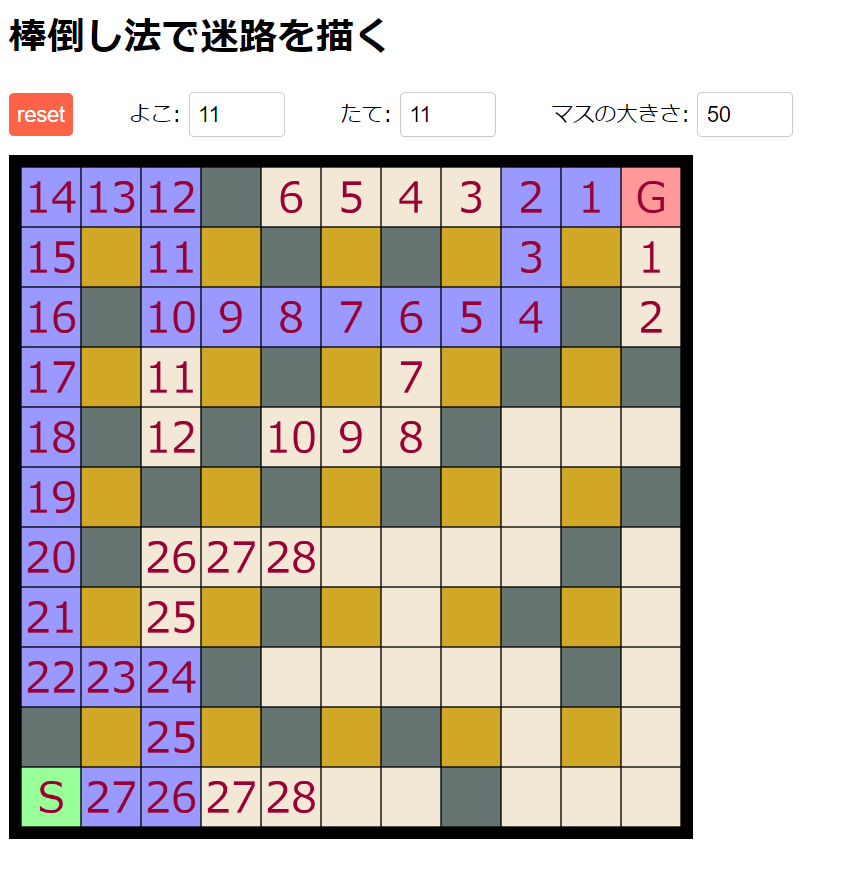

# 棒倒し法アルゴリズムによる迷路作成プログラム

このプログラムは、棒倒し法アルゴリズムを使用して迷路を生成します。迷路は、幅優先探索を用いて解決され、最短経路が描画されます。

## 使い方

1. **依存関係のインストール**:
   プロジェクトのルートディレクトリで以下のコマンドを実行して、必要な依存関係をインストールします。
   ```
   npm install
   ```

2. **開発サーバーの起動**:
   開発サーバーを起動し、ブラウザでプログラムを確認するには、以下のコマンドを実行します。
   ```
   npm run dev
   ```

3. **迷路の生成と解決**:
   ブラウザで表示されたページで、迷路の幅、高さ、ブロックサイズを入力し、「run」ボタンをクリックします。迷路が生成され、幅優先探索によって最短経路が描画されます。

4. **迷路の停止**:
   「reset」ボタンをクリックすると、現在の迷路描画を停止し、設定をリセットします。

## アルゴリズムについて解説するポイント

- **棒倒し法**:
  - 迷路は、たくさんのマスが並んだグリッドとして考えます。奇数の行と列に柱を立てるイメージです。
  - 柱からランダムに選んだ方向に壁を倒して、道を作ります。ここで「ランダム」とは、サイコロを振るように、どの方向に行くかを運任せで決めることです。これによって、どんな迷路ができるかは毎回違ってきます。
  - 壁を倒すときは、すでにある壁を壊してしまいそうな場合はやり直します。

- **幅優先探索**:
  - 迷路を解くために幅優先探索という方法を使います。
  - スタートからゴールまでの一番短い道を探して、その道を描きます。

このプログラムを使うと、迷路がどうやって作られて、どうやって解かれるのかを目で見て理解することができます。ぜひ試してみてくださいね！
